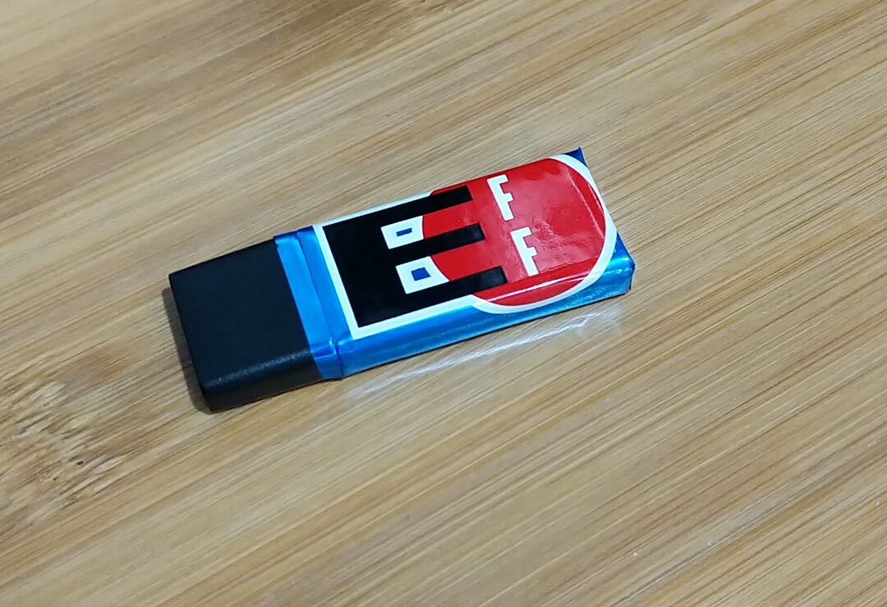

# Parts

- [ST-link V2 Programmer](https://www.aliexpress.com/wholesale?catId=0&initiative_id=SB_20180923152446&SearchText=st-link+v2)
- [Token](https://www.aliexpress.com/wholesale?catId=0&initiative_id=SB_20180923152446&SearchText=st-link+v2)
- [Epoxy](https://www.atomadhesives.com/AA-BOND-2112-Aerospace-Applications-Adhesive)
- [Copper Foil Tape](https://smile.amazon.com/gp/product/B071JKLFXX/)
- [Sticker](https://supporters.eff.org/shop/stickers)

# Tools

- Wire Cutters or Soldering Iron
- SMD IC Grabbers (Optional)
- Dish Soap (Optional)
- Masking Tape (Optional)
- Cardboard (Optional)
- Rubber Gloves (Probably)
- Eye Protection (Good idea)

# Building Gnuk

## Install Build Tools

On Debian/Ubuntu, the following packages should be installed:

~~~
$ sudo apt install build-essentials gcc-arm-none-eabi binutils-arm-none-eabi gdb-arm-none-eabi libnewlib-arm-none-eabi
~~~

## Build Gnuk

Fetch the latest Gnuk sources, configure them, and build:

~~~
$ git clone git://git.gniibe.org/gnuk/gnuk.git
$ cd gnuk
$ git submodule update --init
$ cd src
$ ./configure --vidpid=234b:0000 --target=ST_DONGLE --enable-factory-reset
$ make
~~~

# Programming The Token

## Attach Programmer to Target

Attach `SWDIO` from your programmer to the `SWDIO` JTAG contact on your Target.
Attach `SWDCLK` from your programmer to the `SWDCLK` JTAG contact on your
Target. (Make sure that your wires aren't contacting any other components on
the target token.)

At the time of writing, most ST-Link v2 devices have `SWDIO` as the 2nd contact
in from the USB port, and `SWDCLK` as the 3rd contact in from the USB port.
(Shown here with the white cable to `SWDIO` and black cable to `SWDCLK`.)

Attach the `3.3V` power pin from your programmer, to the `3.3V` power pin on
your target. Attach the `GND` pin from your programmer, to the `GND` pin on
your target.

## Write image

Use OpenOCD to write your built Gnuk image to your token.

~~~
$ sudo openocd -f interface/stlink.cfg -f target/stm32f1x.cfg -c "init" -c "reset halt" -c "stm32f1x unlock 0" -c "reset halt" -c "flash write_bank 0 build/gnuk.bin 0" -c "stm32f1x lock 0" -c "shutdown"
Open On-Chip Debugger 0.10.0+dev-00537-g4423a58b (2018-09-17-17:13)
Licensed under GNU GPL v2
For bug reports, read
        http://openocd.org/doc/doxygen/bugs.html
Info : auto-selecting first available session transport "hla_swd". To override use 'transport select <transport>'.
Info : The selected transport took over low-level target control. The results might differ compared to plain JTAG/SWD
adapter speed: 1000 kHz
adapter_nsrst_delay: 100
none separate
Info : Unable to match requested speed 1000 kHz, using 950 kHz
Info : Unable to match requested speed 1000 kHz, using 950 kHz
Info : clock speed 950 kHz
Info : STLINK v2 JTAG v17 API v2 SWIM v4 VID 0x0483 PID 0x3748
Info : using stlink api v2
Info : Target voltage: 3.262028
Info : stm32f1x.cpu: hardware has 6 breakpoints, 4 watchpoints
Info : Listening on port 3333 for gdb connections
target halted due to debug-request, current mode: Thread
xPSR: 0x01000000 pc: 0x08002764 msp: 0x20000800
Info : device id = 0x20036410
Warn : STM32 flash size failed, probe inaccurate - assuming 128k flash
Info : flash size = 128kbytes
Info : Device Security Bit Set
target halted due to breakpoint, current mode: Thread
xPSR: 0x61000000 pc: 0x2000003a msp: 0x20000800
stm32x unlocked.
INFO: a reset or power cycle is required for the new settings to take effect.
target halted due to debug-request, current mode: Thread
xPSR: 0x01000000 pc: 0xfffffffe msp: 0xfffffffc
target halted due to breakpoint, current mode: Thread
xPSR: 0x61000000 pc: 0x2000003a msp: 0xfffffffc
wrote 112640 bytes from file build/gnuk.bin to flash bank 0 at offset 0x00000000 in 3.387869s (32.469 KiB/s)
target halted due to breakpoint, current mode: Thread
xPSR: 0x61000000 pc: 0x2000003a msp: 0xfffffffc
stm32x locked
shutdown command invoked
~~~

## Verify Programming

Plug the newly programmed token in to a USB port and verify that it is now
functioning as a GnuPG token:

~~~
$ gpg --card-status
Reader ...........: 234B:0000:FSIJ-1.2.10-87113410:0
Application ID ...: D276000124010200FFFE871134100000
Version ..........: 2.0
Manufacturer .....: unmanaged S/N range
Serial number ....: 87113410
Name of cardholder: [not set]
Language prefs ...: [not set]
Sex ..............: unspecified
URL of public key : [not set]
Login data .......: [not set]
Signature PIN ....: forced
Key attributes ...: rsa2048 rsa2048 rsa2048
Max. PIN lengths .: 127 127 127
PIN retry counter : 3 3 3
Signature counter : 0
Signature key ....: [none]
Encryption key....: [none]
Authentication key: [none]
General key info..: [none]
~~~

# Remove Extra Components

## Plastic

To aid remove of the plastic piece, place the end of the token in some soapy
water:

Grasp the plastic piece firmly, and slide it off the end of the pins:

## Pins

The token's extra pins can be removed either by clipping them off with wire
cutters, or removed with a soldering iron. (Eye protection recommended):

# Apply Epoxy

## Prepare for Epoxy

Return the token to the original aluminum case:

Use masking tape to protect the token from any spilled epoxy:

Secure the taped tokens in an upright position.

## Applying Epoxy

Mix your epoxy appropriately, then fill the aluminum case. Make sure that the
case is entirely filled, and that the token is completely coated:

Allow the epoxy to cure for the appropriate length of time before handling.

# Apply Shielding

Prepare a `3.5x1` inch piece of copper foil tape. Apply the tape, length-wise,
to the outside of the token:

# Apply Style

Attach tamper evident tape, or a sweet sticker, to the outside of the token:

# Use

For information on how to use your new token, reference our cheatsheets here:

[GnuPG Cheatsheets](https://github.com/capt8bit/GnuPG_Cheatsheets)
